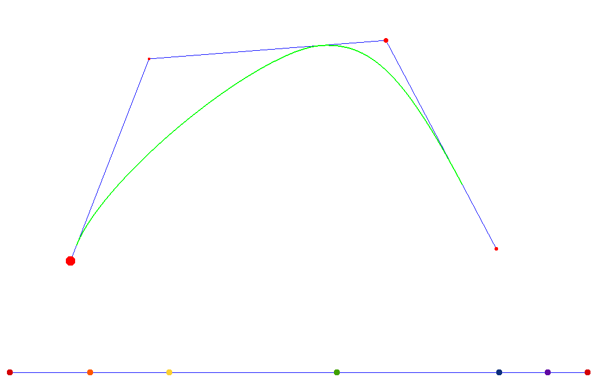

# NURBS curve
Project for Computer Graphics course.

### Summary
This project renders a NURBS curve, if you have put down 3 controlpoints at least.  
Controlpoints, weights and knot values can be changed, see Usage section below.  

You will need GLFW to compile this project:  
[GLFW download page](http://www.glfw.org/download.html)

And here is a screenshot of it working:

### Usage
All controlpoints can be moved around by clicking on them,  
you can change a controlpoint's weight by scrolling up/down with the mouse,
at the bottom knot values can be changed and there is a few keyboard shortcuts:

* Keypad '+' : Adding a new knot value (at the end) and increasing the order of the curve
* Keypad '-' : Removing a knot value (from the end) and decreasing the order of the curve
* Up arrow : Increasing the max knot value
* Down arrow : Decreasing the max knot value
